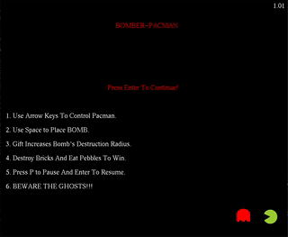
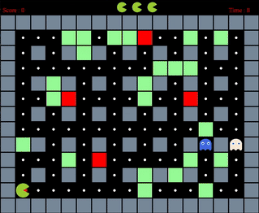

# Bomber-Pacman

Bomber-Pacman (combination of Bomberman and Pacman) is a 2D game built in C++ using GLUT (OpenGL Utility Toolkit).

<table>
  <tr>
    <td></td>
    <td></td>
  </tr>
</table>


## Getting Started

### Dependencies

To install dependencies, execute
```
make install
```

### Compile

To compile the code, execute
```
make
```

### Play

To play the game, execute
```
make play
```

### Clean
To clean, execute
```
make clean
```


## Gameplay

The basic gameplay rules are listed in the following subsections.

### Player
The player moves around the board using arrow keys. Bomb is placed on the board using Space key. If player runs into a enemy, he loses a life, and the enemies and player are all reset to their
original starting locations.

### Bricks
Board consists of different types of bricks. 
* Solid Bricks are part of environment and will not break by bomb blast.
* Green Bricks are Breakable bricks and will break if they come in the destruction radius of bomb. Breaking this brick earns 100 points.
* Red Bricks are special bricks and will not only break themselves but will also break one extra brick on each of
their side also. Breaking this brick earns 200 points however they can be broken after 50 seconds.

### Bomb
Player can place a bomb wherever it moves on the board. Once the bomb is placed, it blasts after 1 second. Blast will destroy breakable bricks, any enemy or player itself, if present in that radius.

### Enemies
The enemies move according to a Breadth First Search algorithm. The enemies’ behavior changes (each one has a different behavior). The enemies navigate the board in three different
modes:
* Chase: the enemies chase BomberMan
* Scatter: the enemies move towards the corners of the map
* Frightened: the enemies move randomly

### Winning or Losing
The game ends either when all of the bricks are destroyed and energizers are eaten or when player loses all of his lives.

## Environment

Ubuntu 22.04
C++11